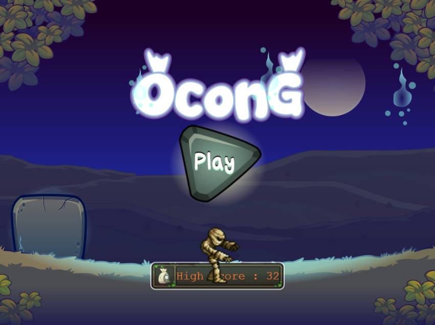
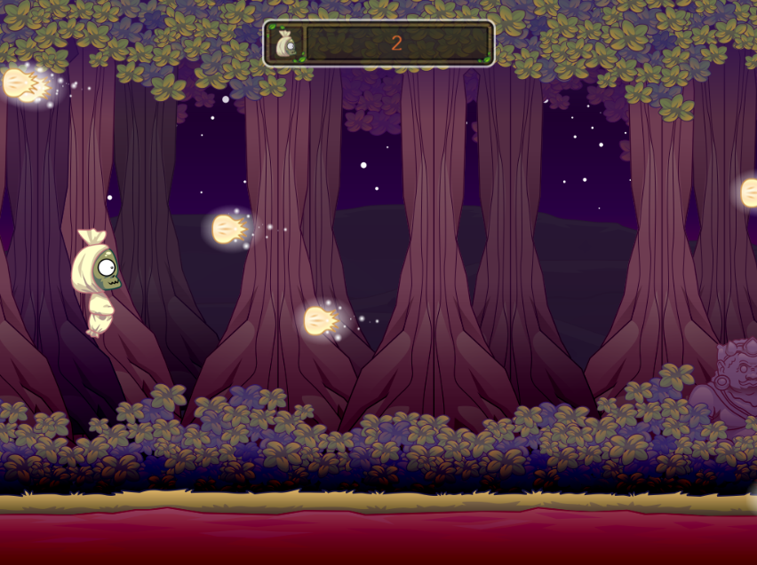

# 👻 Game Pocong Run

Game 2D sederhana bertema horor lucu di mana pemain harus menghindari rintangan dan terus berlari sambil mengumpulkan poin. Cocok untuk hiburan ringan dengan suasana menyeramkan tapi seru!

---

## 🎮 Tampilan Game

### 🧭 Menu Utama
Tampilan awal game dengan opsi untuk memulai permainan.



---

### 🚀 Gameplay (Play)
Tampilan saat permainan berlangsung, di mana karakter utama (pocong) harus bergerak dan menghindari rintangan.



---

## ⚙️ Teknologi yang Digunakan

- Game Engine: [Contoh: Unity, Godot, GDevelop, HTML5 Canvas]
- Bahasa Pemrograman: [HTML, JavaScript]
- Asset: Ilustrasi custom bertema pocong

---

## 🚀 Cara Menjalankan Game

1. Clone repository:
   ```bash
   git clone https://github.com/username/pocong-run-game.git
